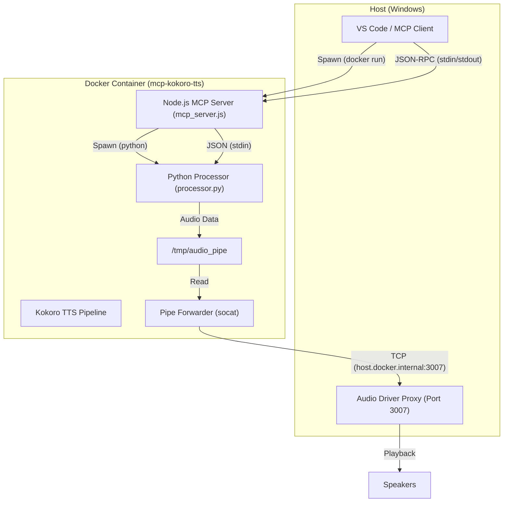
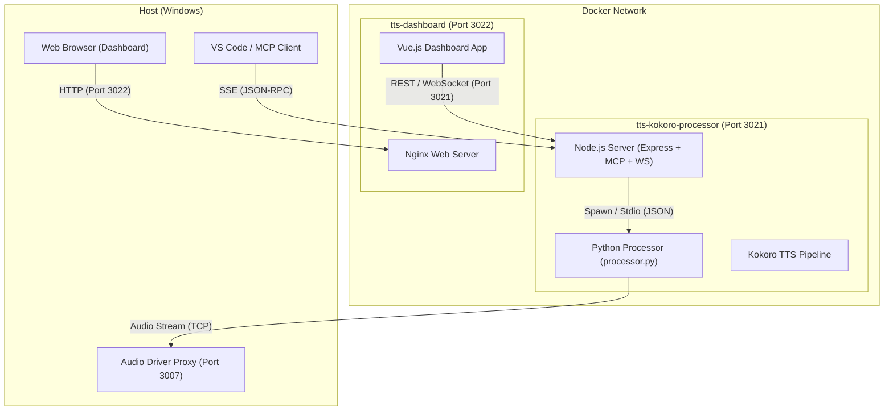
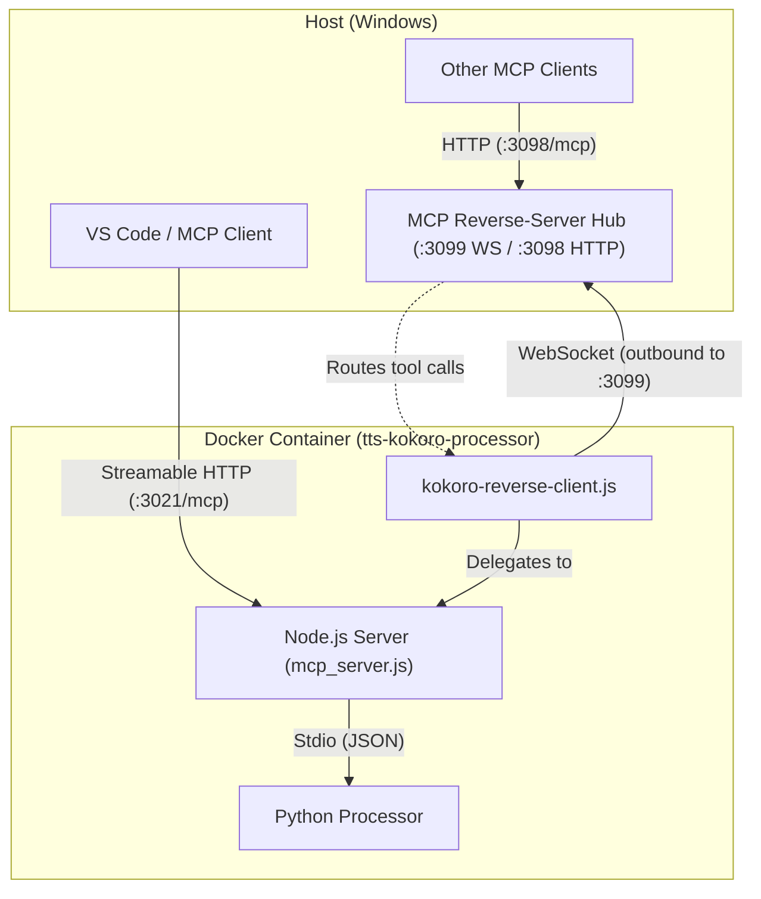

# Kokoro TTS MCP Architecture

## Current Architecture (Stdio)

The current implementation uses a Docker container running a Python-based TTS processor (`processor.py`) which is wrapped by a Node.js MCP server (`mcp_server.js`). The communication happens via standard input/output (stdio).

### Diagram

### Implementation Details

1.  **MCP Client (VS Code)**:
    *   Reads `.vscode/mcp.json`.
    *   Executes `docker run -i --rm ... mcp-kokoro-tts`.
    *   Connects to the container's `stdin` and `stdout` to send JSON-RPC requests.

2.  **Node.js MCP Server (`mcp_server.js`)**:
    *   Runs inside the container as the entry point (via `start.sh`).
    *   Spawns `processor.py` as a child process.
    *   Receives MCP tool calls (`speak`) from VS Code.
    *   Forwards the text/voice/speed payload to `processor.py` via its `stdin`.

3.  **Python Processor (`processor.py`)**:
    *   Initializes the Kokoro TTS pipeline (loading models).
    *   Runs a `stdin_reader` thread to listen for JSON payloads from `mcp_server.js`.
    *   Generates audio using `kokoro`.
    *   Writes raw audio data (PCM) to a named pipe `/tmp/audio_pipe`.

4.  **Audio Output**:
    *   `forward_pipe.sh` runs in the background (started by `start.sh`).
    *   It uses `socat` to read from `/tmp/audio_pipe` and forward the data via TCP to `host.docker.internal:3007`.
    *   On the host, an "Audio Driver Proxy" (presumably running on port 3007) receives the stream and plays it.

## The "New Container Per Session" Issue

Currently, the `mcp.json` configuration uses `type: "stdio"`. This means:
1.  When the MCP client connects (e.g., you open a workspace or reload the window), it spawns the `command` (`docker run ...`).
2.  This creates a **new** Docker container instance.
3.  When the client disconnects, the process terminates, and the container is removed (due to `--rm`).

**Problem**:
*   **Slow Startup**: Loading the Kokoro models takes time (initializing the pipeline).
*   **Resource Waste**: A new container is spun up for every session.
*   **No Persistence**: State is lost between sessions (though TTS is mostly stateless).

## Persistent Architecture with Dashboard

The system has been migrated to a persistent architecture using SSE for MCP communication and includes a dedicated Dashboard for monitoring and control.

### Diagram

### Components

1.  **Node.js Server (`mcp_server.js`)**:
    *   **MCP Endpoint**: `/sse` for VS Code communication.
    *   **REST API**: `/api/status`, `/api/history`, `/api/control` for the Dashboard.
    *   **WebSocket**: Real-time status updates to the Dashboard.
    *   **State Management**: Maintains history and current status in memory.

2.  **Python Processor (`processor.py`)**:
    *   **Input**: Receives JSON commands via `stdin`.
    *   **Output**: Emits JSON status events (start, finish, error) via `stdout`.
    *   **Audio**: Streams raw audio to the Audio Proxy via a named pipe and `socat`.

3.  **Dashboard (`tts-dashboard`)**:
    *   **Tech Stack**: Nginx serving a static Vue.js (CDN) application.
    *   **Features**:
        *   **Status**: View connection state, current voice, and processing status.
        *   **History**: List of recently spoken items with Replay functionality.
        *   **Control**: Change default voice, Stop playback.
        *   **Live View**: See the text currently being spoken.

### API Endpoints

*   `GET /api/status`: Returns current state (idle/processing), current text, and voice settings.
*   `GET /api/history`: Returns a list of past spoken items.
*   `POST /api/control`: Send commands like `stop` or `set_voice`.
*   `POST /api/replay`: Re-queue a specific history item.

### WebSocket Events

*   `status`: Broadcasts the full state object whenever it changes.
*   `history`: Broadcasts the updated history list when a new item is added.

## MCP Reverse-Client Integration

In addition to the Streamable HTTP MCP endpoint, the processor connects **outbound** to the MCP reverse-server broker hub via WebSocket. This makes all TTS tools discoverable by any MCP client connected to the hub — no direct configuration needed.

### Diagram

### How It Works

1.  **On startup**, after the HTTP server is listening, `mcp_server.js` calls `startReverseClient()` from `kokoro-reverse-client.js`.
2.  The module dynamically imports the `ReverseClient` SDK (mounted from `mcp-reverse-client/sdk.js` into the container as `/app/reverse-client-sdk.js`).
3.  A `ReverseClient` instance registers as `kokoro-tts` with the reverse-server at `ws://host.docker.internal:3099`.
4.  **14 tools** are published across 5 categories (see below).
5.  Any MCP client connected to the reverse-server sees these tools namespaced as `kokoro-tts__<tool_name>`.
6.  Auto-reconnect ensures the tools re-appear if the reverse-server restarts.

### Published Tools (14 total)

| Category | Tool | Description |
|----------|------|-------------|
| **Speech** | `speak` | Convert text to speech, play through speakers |
| | `speak_mp3` | Convert text to speech, save as MP3 file |
| | `speak_with_options` | Full control: voice, speed, mp3, announce |
| **Voice** | `list_voices` | List all 11 available Kokoro voices |
| | `set_default_voice` | Change the default voice |
| | `get_current_voice` | Get the active default voice |
| | `preview_voice` | Speak a sample in a given voice |
| **Status** | `get_status` | Processor state, current text, voice |
| | `get_history` | Recent speech history (last N items) |
| | `replay` | Re-speak a previous history item |
| | `clear_history` | Clear the speech history |
| **Control** | `ping` | Health check with uptime |
| | `get_capabilities` | Full feature list, voices, config |
| **Batch** | `narrate_document` | Split document into paragraphs and queue |

### Configuration

| Environment Variable | Default | Description |
|---------------------|---------|-------------|
| `REVERSE_SERVER_URL` | `ws://host.docker.internal:3099` | WebSocket URL of the reverse-server |

### Graceful Degradation

If the reverse-client SDK is not mounted (volume missing), the module logs a warning and disables itself — the rest of the server operates normally. If the reverse-server is unreachable at startup, the SDK auto-reconnects in the background.

