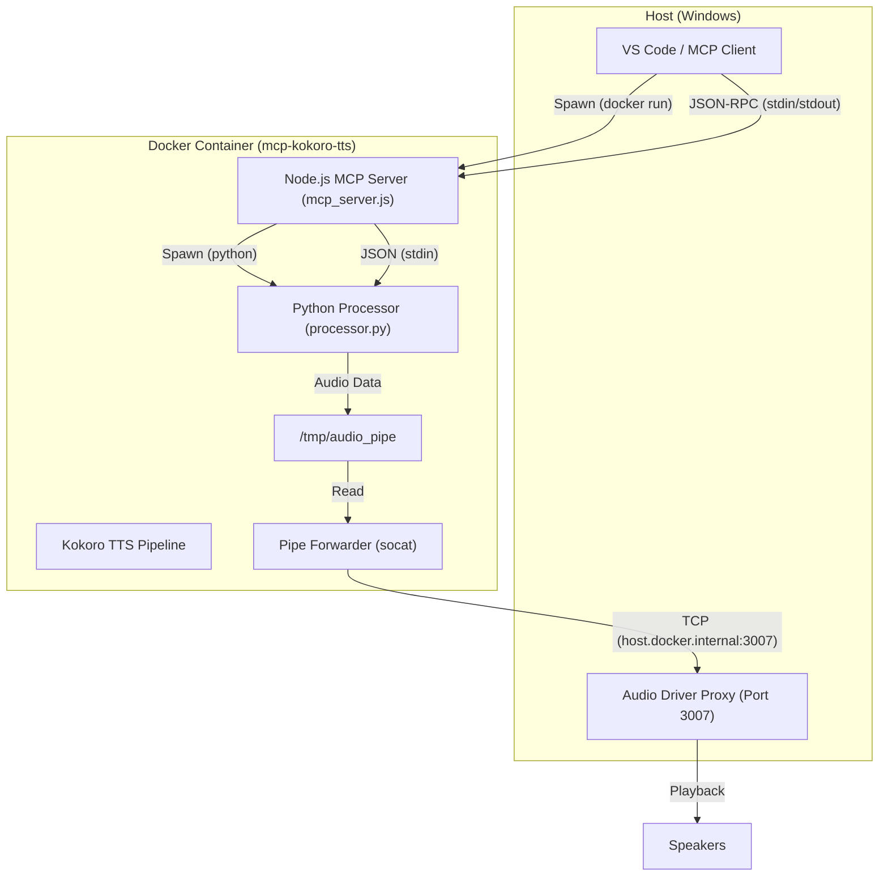
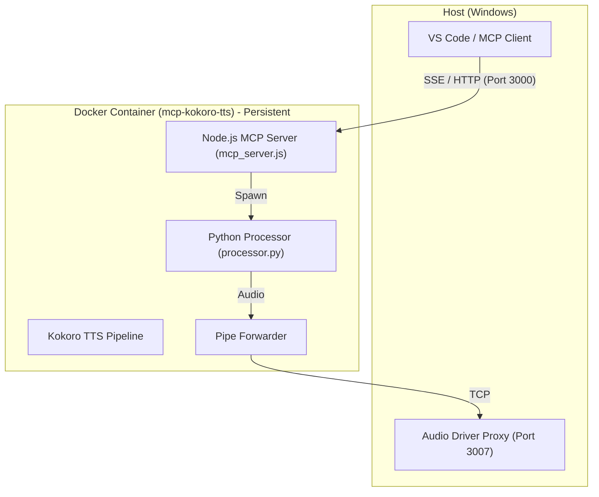

# Kokoro TTS MCP Architecture

## Current Architecture (Stdio)

The current implementation uses a Docker container running a Python-based TTS processor (`processor.py`) which is wrapped by a Node.js MCP server (`mcp_server.js`). The communication happens via standard input/output (stdio).

### Diagram



### Implementation Details

1.  **MCP Client (VS Code)**:
    *   Reads `.vscode/mcp.json`.
    *   Executes `docker run -i --rm ... mcp-kokoro-tts`.
    *   Connects to the container's `stdin` and `stdout` to send JSON-RPC requests.

2.  **Node.js MCP Server (`mcp_server.js`)**:
    *   Runs inside the container as the entry point (via `start.sh`).
    *   Spawns `processor.py` as a child process.
    *   Receives MCP tool calls (`speak`) from VS Code.
    *   Forwards the text/voice/speed payload to `processor.py` via its `stdin`.

3.  **Python Processor (`processor.py`)**:
    *   Initializes the Kokoro TTS pipeline (loading models).
    *   Runs a `stdin_reader` thread to listen for JSON payloads from `mcp_server.js`.
    *   Generates audio using `kokoro`.
    *   Writes raw audio data (PCM) to a named pipe `/tmp/audio_pipe`.

4.  **Audio Output**:
    *   `forward_pipe.sh` runs in the background (started by `start.sh`).
    *   It uses `socat` to read from `/tmp/audio_pipe` and forward the data via TCP to `host.docker.internal:3007`.
    *   On the host, an "Audio Driver Proxy" (presumably running on port 3007) receives the stream and plays it.

## The "New Container Per Session" Issue

Currently, the `mcp.json` configuration uses `type: "stdio"`. This means:
1.  When the MCP client connects (e.g., you open a workspace or reload the window), it spawns the `command` (`docker run ...`).
2.  This creates a **new** Docker container instance.
3.  When the client disconnects, the process terminates, and the container is removed (due to `--rm`).

**Problem**:
*   **Slow Startup**: Loading the Kokoro models takes time (initializing the pipeline).
*   **Resource Waste**: A new container is spun up for every session.
*   **No Persistence**: State is lost between sessions (though TTS is mostly stateless).

## Proposed Improvement: Persistent Server (HTTP/SSE)

To reuse the container, we should run it as a long-lived service (daemon) and have the MCP client connect to it via HTTP or SSE.

### Proposed Architecture



### Steps to Migrate

1.  **Update `mcp_server.js`**:
    *   Switch from `StdioServerTransport` (or the current hybrid approach) to `StreamableHTTPServerTransport` (SSE) or a simple HTTP server.
    *   Expose a port (e.g., 3000) in the container.

2.  **Update Docker Command**:
    *   Run the container in detached mode (`-d`) or via Docker Compose, mapping the port (e.g., `-p 3021:3000`).
    *   Do *not* let VS Code manage the container lifecycle via `mcp.json` `command`.

3.  **Update `mcp.json`**:
    *   Change `type` to `sse` (or `http` if using a proxy).
    *   Set `url` to `http://localhost:3021/sse`.

### Example `mcp.json` (SSE)

```json
{
  "mcpServers": {
    "kokoro-tts": {
      "type": "sse",
      "url": "http://localhost:3021/sse"
    }
  }
}
```

### Benefits
*   **Instant Response**: The model is already loaded in the running container.
*   **Efficiency**: Only one container running regardless of how many VS Code windows are open.
