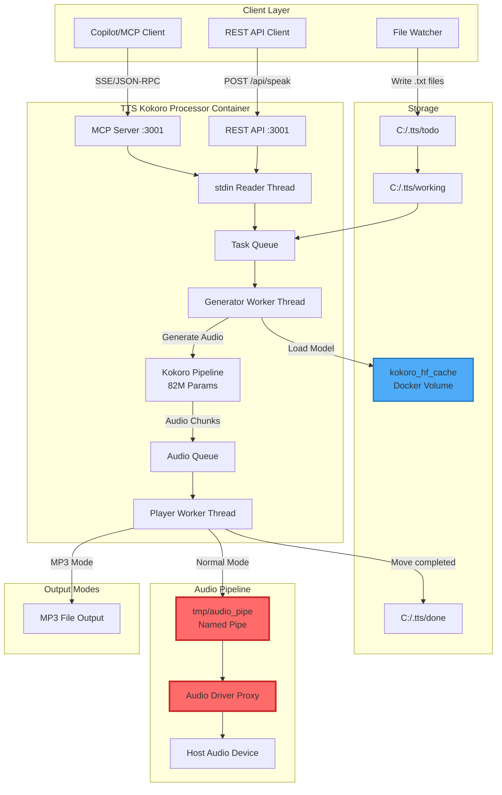

# TTS Kokoro Processor

A Python service that monitors a folder for text files and speaks them using the **Kokoro** open-weight TTS model (82M parameters). This service provides both file-based and MCP (Model Context Protocol) interfaces for text-to-speech generation.

## ⚠️ CRITICAL: Named Pipe Dependency

**The audio driver proxy MUST be running BEFORE starting tts-kokoro-processor.**

The processor writes audio to `/tmp/audio_pipe`, which is provided by the audio-driver-proxy service. If the named pipe is not available when the processor starts, **it will crash the entire Docker daemon** on Windows.

**Start order:**
1. Start audio-driver-proxy first: `docker compose up -d` (from audio-driver-proxy directory)
2. Then start tts-kokoro-processor: `docker compose up -d --build` (from this directory)

## Architecture



### Processing Flow

1. **Input Stage**: Text arrives via MCP tool call, REST API, or file drop
2. **Queue Management**: Tasks are queued with metadata (voice, speed, mp3 options)
3. **Generation**: Kokoro pipeline converts text to audio chunks (24kHz)
4. **Output Stage**:
   - **Normal Mode**: Chunks stream to `/tmp/audio_pipe` → audio-driver-proxy → speaker
   - **MP3 Mode**: Chunks accumulate, then write to MP3 file + announce completion
5. **Completion**: File-based tasks move to `done` folder

## Configuration

- **Volume**: Mounts host `C:/.tts` to `/app/data` and `C:/temp` to `/app/temp`.
- **Cache**: Uses a Docker volume `kokoro_hf_cache` to store the downloaded model weights (~300MB).
- **Voice**: Configurable via `KOKORO_VOICE` in `.env` file. Defaults to `af_heart`.
- **Port**: Exposes MCP/REST API on port `3021` (maps to container port `3001`).
- **Base Image**: Built on `audio-driver-proxy:latest` for audio pipeline access.
- **MP3 Output**: MP3 files should be written to `/app/data/mp3/` (host: `C:/.tts/mp3/`) or `/app/temp/` (host: `C:/temp/`).

## MCP Tool Interface

The service exposes a `speak` tool via MCP:

```javascript
{
  "text": "Text to convert to speech",
  "voice": "af_heart",  // Optional
  "speed": 1.0,         // Optional
  "mp3": false,         // Optional: output to MP3 file
  "mp3_path": "/app/temp/output.mp3"  // Container path (use /app/data/ or /app/temp/)
}
```

**MP3 Mode**: When `mp3: true`, the entire audio is written to a file (no chunking), and the file creation is announced to the speaker.

**MP3 Path Examples**:
- Container: `/app/temp/my_audio.mp3` → Host: `C:/temp/my_audio.mp3`
- Container: `/app/data/mp3/my_audio.mp3` → Host: `C:/.tts/mp3/my_audio.mp3`

## Dynamic Voice & Parameter Control

You can change the voice, speed, and volume dynamically within the text file using tags in the format `{key:value}`.

### Supported Tags

-   **`{voice:name}`**: Switches the voice.
    -   Example: `{voice:am_michael}`
    -   Valid values: See "Available Voices" below.
-   **`{speed:float}`**: Changes the playback speed.
    -   Example: `{speed:1.2}` (20% faster), `{speed:0.8}` (20% slower).
    -   Default: `1.0`.
-   **`{volume:int}`**: Changes the playback volume (0-100+).
    -   Example: `{volume:50}` (Half volume), `{volume:150}` (Boosted).
    -   Default: `100`.

### Example Text File

```text
Hello there. {voice:am_michael} I am now speaking with a different voice.
{speed:1.5} And now I am speaking faster! {speed:1.0} Back to normal.
{voice:af_bella} {volume:50} I am whispering now.
```

## Available Voices

You can change the voice by editing the `.env` file or using the `{voice:name}` tag:

### American English

- `af_heart` (Female - Default)
- `af_bella` (Female)
- `af_nicole` (Female)
- `af_sarah` (Female)
- `af_sky` (Female)
- `am_adam` (Male)
- `am_michael` (Male)

### British English

- `bf_emma` (Female)
- `bf_isabella` (Female)
- `bm_george` (Male)
- `bm_lewis` (Male)

## Usage

### Prerequisites

1. **Ensure audio-driver-proxy is running:**
   ```bash
   cd ../pipes/audio-driver-proxy
   docker compose up -d
   ```

2. **Verify the named pipe exists:**
   ```bash
   docker exec <audio-proxy-container> ls -la /tmp/audio_pipe
   ```

### Build & Run

```bash
docker compose up -d --build
```

**Note:**
- The first run will take some time to download the model weights from Hugging Face (~300MB).
- Kokoro models persist in the `kokoro_hf_cache` Docker volume, so rebuilds won't re-download them.

### Verify Service

```bash
# Check container status
docker compose ps

# Check logs
docker compose logs -f

# Test API
curl http://localhost:3021/api/status
```

### Safe Updates

To update the container without re-downloading Kokoro models:

```bash
docker compose up -d --build
```

The named volume `kokoro_hf_cache` preserves model weights across rebuilds.
